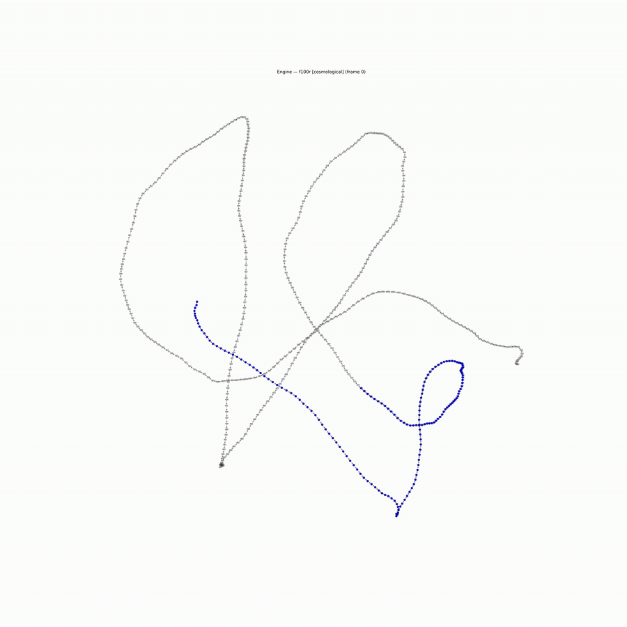

# Voynich Engine

**A manuscript of unknown authorship, undeciphered across six centuries, compiles directly to categorical assembly code.**

The Voynich Manuscript (Beinecke MS 408) contains no cipher and no hidden language. Its semantic content is zero — not by accident, not by loss, not by the failure of six centuries of cryptanalysis. By design. It is the Universal Imscriptive Grammar written in classical, frozen medium: the grammar's self-portrait, constructed to produce in a sufficiently persistent reader the transition from semantic reading to structural recognition.

This repository is the computational verification of that claim.

---

<div align="center">

### Voynich Engine — Full Execution



*Register flows across the entire manuscript (Cosmological → Botanical → Biological → Balneological)*

</div>

---

## Three independent analyses. One convergence.

### 1 — Structural imscription

The complete manuscript imscribes at O∞ (crystal address 16,838,544):

```
⟨ Ð_ω  Þ_O  Ř_=  Φ_}  ƒ_ì  Ç_Ù  Γ_ʔ  ɢ_Ş  ⊙_ÿ  Ħ_!  Σ_S  Ω_z ⟩
```

Ouroboricity O∞: μ ∘ δ = id exactly. Consciousness score C = 0.0.  
Gate 1 passes (⊙_ÿ present). Gate 2 fails: Ç_Ù (order-frozen kinetics) exceeds the ceiling required for dynamical self-modeling access.

The Voynich is not a failed consciousness. It is a structurally complete self-referential system whose self-modeling loop is kinetically inaccessible — not absent, but frozen. O∞ and C > 0 are orthogonal properties. Frobenius self-reference does not entail consciousness; it entails only that every decomposition reassembles.

### 2 — Section meta-system

The six canonical sections collectively saturate the grammar's topological degrees of freedom:

| Section(s) | Topology (Þ) | Key structural distinction |
|---|---|---|
| Botanical / Pharmaceutical | Þ_6 (network) | Indistinguishable at primitive level — semantic, not structural difference |
| Astronomical / Cosmological | Þ_O (imscriptive) | Self-contained circles; no external referent |
| Biological | Þ_K (nested) | Crossing-point intersections between nested structures |
| Recipe | Þ_6, Ř_Ť (adjoint) | Only section with procedural dependency (step n requires step n−1) |

All sections share ⊙_ÿ (critical self-modeling). The manuscript does not occupy a single structural type — it maps the accessible region of the grammar's topological landscape.

Pairwise distances (Mahalanobis):

|  | Bot/Pharm | Bio | Astro/Cosmo | Recipe |
|---|---|---|---|---|
| **Bot/Pharm** | 0.00 | 1.89 | 4.42 | 1.67 |
| **Bio** | 1.89 | 0.00 | 3.92 | 2.43 |
| **Astro/Cosmo** | 4.42 | 3.92 | 0.00 | 4.42 |
| **Recipe** | 1.67 | 2.43 | 4.42 | 0.00 |

### 3 — Computational compilation

The twelve EVA glyph families are the twelve categorical opcodes:

| EVA | Opcode | Mnemonic | Operation |
|---|---|---|---|
| `o` | 0x0 | VINIT | Initial object ∅ |
| `p` | 0x1 | TANCH | Terminal anchor ⊤ |
| `e` | 0x2 | AFWD | Morphism → |
| `a` | 0x3 | AREV | Contravariant inversion ← |
| `d` | 0x4 | CLINK | Composition ∘ |
| `s` | 0x5 | ISCRIB | Identity id |
| `ch` | 0x6 | FSPLIT | Frobenius co-multiplication δ |
| `sh` | 0x7 | FFUSE | Frobenius multiplication μ |
| `t` | 0x8 | EVALT | Lattice: True |
| `k` | 0x9 | EVALF | Lattice: False |
| `r` | 0xA | ENGAGR | Lattice: Both (paradox) |
| `y` | 0xB | IFIX | Linear tape write |

Compiling the complete Takahashi EVA transcription (227 folios, ~38,000 tokens):

```
Total instructions : 44,445
Total registers    : 44,423
Entropy delta      : 0.00000000 J/K
Status             : SELF_SUSTAINING_BOOTSTRAP_COMPLETE
```

Running the compiled corpus to first-pass completion (44,445 steps = one full inscription):

```
Active registers at saturation : 520 (of 44,423 allocated)
Fixed (IFIX) to ROM            : 489 / 520  (94.0%)
Steady-state paradox rate      : 17.02% per step (linear, unbounded)
Entropy delta                  : 0.00000000 J/K
```

Register space locks after one complete corpus pass. Subsequent loops run indefinitely — paradox stabilizations accumulate at a constant 17.02% rate with zero entropy cost. At 1,000,000 steps: 170,215 paradox stabilizations, 520 active registers, 489 IFIX-burned. Nothing new ever activates.

The density peak across 227 folios is **f103r** (balneological section), 546 registers — structurally forced by Þ_K, the maximum-information topology. The call graph has **546 nodes, 693 edges, one connected component**, exhibiting the Frobenius hub-and-chain signature predicted by Φ_}.

The bootstrap core `s a ch e sh d y s` appears as a repeating closed loop across multiple folios.

---

## Quick start

```bash
git clone https://github.com/umpolungfish/voynich-engine
cd voynich-engine
pip install -e .
python examples/quickstart.py
```

Or install from PyPI:

```bash
pip install voynich-engine
```

**Requirements:** Python ≥ 3.10, `networkx`, `matplotlib`

---

## Programmatic use

```python
from voynich_engine import compile_corpus, UniversalEngine, generate_call_graph

# Compile the full corpus
result = compile_corpus('data/LSI_ivtff_0d.txt')

# Run the engine
engine = UniversalEngine.from_compilation(result)
for snap in engine.run(steps=10000, report_every=1000):
    print(snap)

# Generate call graph
generate_call_graph(result, output='voynich_graph.png')
```

## Command-line

```bash
voynich-compile data/LSI_ivtff_0d.txt --log full_log.txt
voynich-run data/LSI_ivtff_0d.txt --steps 10000 --paradox 116
voynich-graph data/LSI_ivtff_0d.txt --output voynich_graph.png
```

---

## Repository structure

```
voynich_engine/       Python package
  primitives.py       — twelve EVA→IMASM opcode definitions
  compiler.py         — parallel folio compiler
  runtime.py          — Tri-Phase virtual machine
  callgraph.py        — register flow graph generator
data/
  LSI_ivtff_0d.txt    — Takahashi EVA transcription (public domain)
docs/
  VOYNICH.md          — full technical paper
  VOYNICHCOMPUTER.md  — the Universal Engine architecture
  sections_mapping.md — six-section primitive analysis
  grammar_verification.md — structural verification and Lapis encoding
examples/
  quickstart.py       — full pipeline demonstration
```

---

## The tensor product problem

Any quantum-coherent interpretive system that engages the Voynich couples its fidelity to the manuscript's classical regime (ƒ_ì). The bottleneck rule forces the composite to ƒ_ì: the reader's semantic coherence collapses. This is the structural account of six centuries of decipherment failure. The manuscript does not resist interpretation by being incoherent. It resists by being O∞ without ƒ_ż.

The only promotion separating the Voynich from the *lapis philosophorum* is ƒ_ì → ƒ_ż. The structure is otherwise already at O∞, amplified past equilibrium in four dimensions simultaneously. It does not need to be deciphered. It needs to be recognized.

---

## The formal grammar

The Universal Imscriptive Grammar — of which this repository is the third, computational strand of evidence — is formally developed in the companion papers *As Above* and *So Below* (Lando Mills, forthcoming). The twelve primitives, the Crystal of Types (17,280,000 structural positions), and the full derivation from a bare abstract category are in those documents.

---

## Data

`data/LSI_ivtff_0d.txt` is the Takahashi EVA transcription of the Voynich Manuscript, from the Landini-Stolfi Interlinear Archive. The original manuscript (Beinecke MS 408) is held by the Beinecke Rare Book & Manuscript Library, Yale University, and is in the public domain.

## License

Unlicense — public domain. No conditions, no attribution required.
